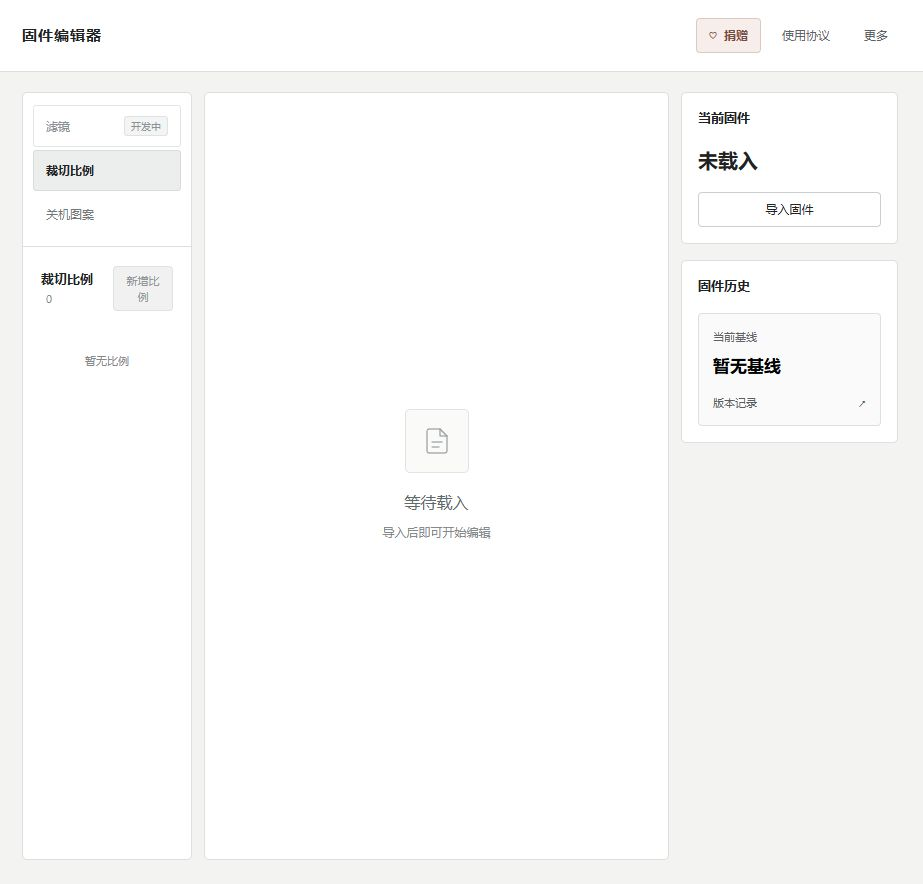

# 使用指南

[返回 README](../README.md)

本指南对应当前公开版，仅包含裁切比例与关机画面。工具在本机运行，只生成文件，不会自动刷写设备。

## 安装与启动

### 下载源码

在 GitHub 仓库页面选择 **Code → Download ZIP**，解压后进入包含 `start.cmd`、`start.sh` 和 `launcher.py` 的目录。已有源码包时直接解压即可。

第一次启动需要联网下载 Python 依赖；源码目录需要有写入权限，启动器会在其中创建 `.venv`。

### Windows

1. 安装 **64 位 Python 3.12**。从 [Python 官方下载页](https://www.python.org/downloads/windows/)选择 3.12 系列；使用官方 Python install manager 时，可运行 `py install 3.12`。
2. 在终端运行以下命令，确认能找到 3.12：

   ```powershell
   py -3.12 --version
   ```

3. 双击 `start.cmd`，等待依赖安装结束和浏览器打开。

若启动窗口一闪而过，在项目目录打开 PowerShell，运行 `./start.cmd` 查看完整错误信息。

### macOS

1. 安装 **Python 3.12**，可从 [Python 官方下载页](https://www.python.org/downloads/macos/)选择该系列的安装包。
2. 在终端确认版本：

   ```sh
   python3.12 --version
   ```

3. 在源码目录运行：

   ```sh
   sh start.sh
   ```

当前支持 Apple Silicon / Intel 的启动入口，macOS 尚未实机验证。依赖包与安装工具的系统要求仍以各自官方说明为准。

### 打开与关闭页面

默认地址为 `http://127.0.0.1:8787`。端口被占用时，启动器会选择其他空闲端口；浏览器未自动打开时，请手动访问启动窗口显示的网址。

使用期间保持启动窗口运行。关闭窗口或按 `Ctrl+C` 停止服务；后续重新启动会继续使用已保存的本机数据。

## 配置生成工具

导入和编辑不需要预先配置 LLVM；生成文件前需要以下四个工具：

```text
clang
llvm-objcopy
llvm-nm
ld.lld
```

如果工具已被自动检测且状态正常，可以直接生成。否则打开 **更多 → 生成设置**，填写 `clang` 可执行文件或其 `bin` 目录；LLD 分开安装、无法自动找到时，再填写 `ld.lld` 的文件或目录。

点击 **检查并保存** 后，工具会执行一次临时 ARM 编译、链接与导出预检。配置保存在本机用户数据目录，路径未变化时通常无需重复设置。

### Windows 的 LLVM

从 [LLVM 官方 Releases](https://github.com/llvm/llvm-project/releases) 下载适用于 Windows x64 的完整 `clang+llvm-…-x86_64-pc-windows-msvc` 包并解压。进入 `bin`，确认包含：

```text
clang.exe
llvm-objcopy.exe
llvm-nm.exe
ld.lld.exe
```

例如解压到 `C:\LLVM`，可在“clang 路径”填写 `C:\LLVM\bin\clang.exe`。这只是示例路径，请使用自己的实际位置。

仅安装 `clang` 或部分组件时，生成预检会提示缺少的具体工具。

### macOS 的 LLVM

已安装 Homebrew 时，可安装 [LLVM](https://formulae.brew.sh/formula/llvm) 与 [LLD](https://formulae.brew.sh/formula/lld)：

```sh
brew install llvm lld
brew --prefix llvm
brew --prefix lld
```

将 LLVM prefix 结果加 `/bin/clang`，LLD prefix 结果加 `/bin/ld.lld`，分别填入设置。系统自带的 Apple Clang 不一定包含所需的其余组件。

### 已有 Android NDK

也可选择已有 NDK 的工具目录：

```text
toolchains/llvm/prebuilt/<本机平台>/bin
```

Windows 选择该目录内的 `clang.exe`，macOS 选择 `clang`。本项目仅调用已有组件，不自动安装或下载 NDK；目录说明见 [Android 官方文档](https://developer.android.com/ndk/guides/other_build_systems)。

## 导入文件

1. 点击右侧 **导入固件**。
2. 选择自己有权使用的 `.bin` 文件。
3. 检查“当前固件”的版本与来源，确认功能按钮可以编辑。

当前支持生成的是已适配官方原版 `1.11.10.7` 及本公开版生成的兼容文件。仅把其他文件改名或修改版本号，不能使其成为兼容输入。

左侧选择功能，中间完成编辑，右侧管理输入、生成和历史记录。



## 编辑裁切比例

以新增 **5:4** 为例：

1. 选择左侧 **裁切比例**，点击 **新增比例**。
2. 填写名称，例如 `5:4`。
3. 在“比例（宽 : 高）”中填写宽 `5`、高 `4`。
4. 点击 **确认**，等待裁切预览更新。
5. 检查预览后，点击右侧 **保存修改**。

宽高必须大于零，支持小数，例如宽 `2.35`、高 `1`。预览用于检查比例，不能替代设备实拍确认。

原厂比例只读保留；自定义比例可以改名、删除，或使用底部的上下箭头调整顺序。自定义项的排序不能跨过原厂条目。

修改宽高后须再次点击 **确认**。未确认的比例会阻止保存和生成。

## 编辑关机画面

1. 选择左侧 **关机图案**，点击 **＋**。
2. 填写图案名称，选择 **上传图片**，再点击 **选择图片**。
3. 选择图片并确认添加，查看中间预览。
4. 选择显示方式；需要时修改名称或点击 **更换图片**。
5. 点击 **保存修改**。

支持选择 PNG、JPEG、WebP、BMP、TIFF 图片。添加时也可选择当前输入中可识别的原厂图案或已有图片。

| 显示方式 | 效果 |
| --- | --- |
| 完整显示 | 等比缩放并保留全部内容，空余区域显示黑底 |
| 铺满画面 | 等比填满显示区域，裁掉超出部分 |

原厂默认图案只读；自定义图案可删除和排序。当前编辑器最多管理 **16 个自定义图案**，名称最多 **24 个 UTF-16 字符**，建议使用普通中文、英文或数字，避免表情和特殊符号。

当前上限是本项目的实现范围，不代表设备硬件的最大容量。页面预览也不证明设备显示效果已通过实机验证。

## 保存与备份

### 保存修改

**保存修改**只保存编辑草稿，不会生成新 BIN。也可使用 `Ctrl+S`（Windows）或 `Cmd+S`（macOS）。

再次使用时，在 **更多 → 已保存的编辑** 中选择记录，点击 **继续编辑**。

### 导出编辑备份

打开 **更多 → 导出编辑备份**，阅读并确认使用要求，下载 JSON 文件。导出确认中提供 **使用协议** 和 **捐赠** 两个入口；本项目免费，捐赠自愿。

编辑备份包含编辑配置和图片素材，**不包含输入 BIN**。它是编辑记录，不是可以刷入设备的文件。

### 恢复编辑备份

1. 先导入该备份对应的输入 BIN。
2. 打开 **更多 → 导入编辑备份**，选择 JSON。
3. 检查恢复的比例和图案，再继续编辑。

输入 BIN 的 SHA-256 必须与备份记录完全一致；只使用相同版本号的其他文件仍可能无法恢复。

## 生成与导出

1. 确认比例已经点击 **确认**、图片素材完整，且 LLVM 配置正常。
2. 点击 **保存修改**。
3. 检查右侧建议的新版本号，点击 **生成固件**。
4. 阅读操作确认，勾选已了解风险与使用要求，再点击 **继续生成**。
5. 成功后分别下载 **固件** 和 **构建清单**，保留版本与 SHA-256 记录。

操作确认底部与生成结果区均提供 **使用协议**、**捐赠** 按钮。

生成只产生文件，不会自动刷写设备，也不会自动把输出切换为当前输入。若要继续编辑生成结果，请重新导入该 BIN，或从固件历史中选择 **载入编辑**。

### 版本编号

- 本机没有更高版本记录时，官方 `1.11.10.7` 首次生成最低为 `1.11.10.10`。
- 后续使用当前输入与本机导入、生成记录的最高末段加一。
- 手动填写的版本号不能低于建议编号。
- 当前版本家族为 `1.11.10.*`，第四段最大为 `255`，到达上限后不能自动跨版本进位。

预留 `.8` / `.9` 是本项目的编号策略，不代表已核实厂商未来的版本安排。Git 发布标签 `v0.1.0` 标识工具源码，与生成 BIN 的版本编号无关。

## 查看历史与回退

点击右侧 **固件历史 → 当前基线** 卡片，打开版本记录。选择版本后可查看来源、SHA-256 和文件状态，并使用可用的下载、载入编辑或回退入口。

**生成回退固件**会按所选历史内容生成一个编号更高的文件，不是把编号直接降低，也不等于恢复了设备。历史文件缺失、输入不兼容或编号达到上限时，相应操作可能不可用。

## 数据位置

| 系统 | 默认数据目录 |
| --- | --- |
| Windows | `%LOCALAPPDATA%\FirmwareEditorDemo` |
| macOS | `~/Library/Application Support/FirmwareEditorDemo` |

输入、图片、草稿、生成记录和工具配置保存在该目录；Python 环境位于源码目录的 `.venv`。`FirmwareEditorDemo` 是当前内部数据目录名，保留该名字以继续读取已有数据。

需要指定其他数据位置或端口时，可以从终端运行：

```powershell
.\start.cmd --data-dir "D:\EditorData" --port 8787
```

```sh
sh start.sh --data-dir "$HOME/EditorData" --port 8787
```

`--no-browser` 表示不自动打开网页，`--port 0` 表示使用系统分配的空闲端口。请为本公开版使用独立数据目录。

## 故障排查

| 现象 | 建议检查 |
| --- | --- |
| 提示 Python 版本错误 | 确认实际启动的是 64 位 Python 3.12，而非其他已安装版本 |
| 首次依赖安装失败 | 检查网络能否访问官方 PyPI，确认源码目录可写，并保留终端错误信息 |
| 页面无法访问 | 保持启动窗口运行，使用它打印的网址；不要固定假设端口一定是 8787 |
| 输入只读或无法生成 | 核对兼容范围；修改文件名或版本号不能完成适配 |
| 比例保存失败 | 为宽高填写正数，并点击“确认”完成预览 |
| 提示缺少 LLVM 组件 | 核对 `clang`、`llvm-objcopy`、`llvm-nm`、`ld.lld` 是否齐全 |
| 工具路径正确但预检失败 | 保存完整错误信息，确认工具支持所需 ARM 编译与链接，再联系作者 |
| 备份无法恢复 | 先导入 SHA-256 与备份匹配的输入 BIN |
| 生成后仍显示旧基线 | 生成不会切换输入；重新导入输出或从历史“载入编辑” |

反馈时请附系统、Python 版本、输入版本、SHA-256、操作步骤和错误信息。不要公开上传未核实权利的完整固件或第三方素材。

## 使用要求与联系

请阅读[使用协议](../web/terms.html)、[作者声明](../AUTHOR_STATEMENT.md)和[第三方材料说明](../THIRD_PARTY_NOTICES.md)。本公开版尚未完成独立端到端与实机验收，生成文件不保证可以使用。

发现异常时应停止继续使用该文件或反复刷写，保留操作记录，并通过 [duanegbrain@163.com](mailto:duanegbrain@163.com) 或[小红书](https://www.xiaohongshu.com/user/profile/69e0548e0000000033026abc)联系作者。
